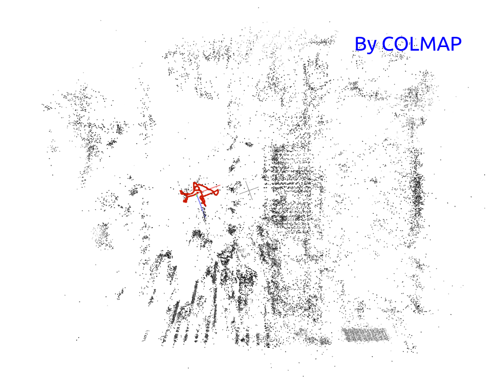
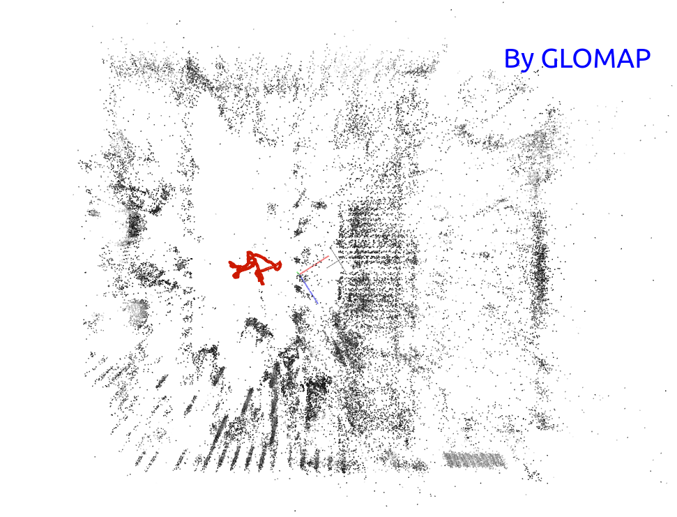

<div style="text-align: center;">
    
</div>

---

<h3 align="center">iKalibr: Unified Targetless Spatiotemporal Calibration Framework</h3>
<p align="center">
    <a href="https://github.com/Unsigned-Long"><strong>Author » Shuolong Chen</strong></a>
</p>


---

<p align="center">
    <a><strong>Version 2.0.0 » iKalibr Is Comming With Support for RGBD Cameras</strong></a>
</p>

:tada: ​RGBD cameras are now supported in `iKalibr`! It is **not an extension** of the normal optical cameras already in `iKalibr`, but a new modeling and calibration method. Because of this, it is no longer necessary to perform time-consuming SfM to calibrate RGBD-Inertial suites (SfM is required when calibrating normal optical camera-IMU suites in `iKalibr`). The corresponding datasets and codes has been open-sourced and integrated into the new version of `iKalibr`. Come and try it!

<div align=center>
    
</div>

<div align=center>
    
</div>

For more details about the newly released RGBD-Inertial calibration method, please refer to our article :point_down::

```tex
# todo
```

Other small changes in this version are:

+ fix (a really severe) bug: when both the camera and LiDAR are introduced into `iKalibr` for calibration, the consistent depth map between the camera and LiDAR can be exported by the user (by specifying the `Preference::Outputs::VisualLiDARCovisibility` option in the configuration file). The inverse depth image is of type `CV_32FC1` and should not be of type `PNG` when exported to the disk. In the new version, this bug is fixed and the output type is `TIFF`.
+ For `cpp` header files with template functions, the description and definition of the template functions are separated to speed up recompilation. At the same time, the implementation of `CalibSolver` is also separated into multiple source files according to the processing steps to speed up recompilation.
+ Optimize some codes for logic, readability and efficiency.

**Attention**: Due to the many new features brought by the version update, `iKalibr`'s configuration file have changed significantly. For the existing old configuration files, if you need to use them, please refer to the latest configuration file [template](https://github.com/Unsigned-Long/iKalibr/blob/master/docs/details/config_template_note.md) and modify them appropriately. This won't take long.


<p align="center">
    <a><strong>Version 1.2.1 » Refinement For Sensor Data IO & Open Discussion</strong></a>
</p>


The main changes in this version are:

+ Add function `RefineImgMsgWrongEncoding`, to refine encoding type of images. Although the encoding type is clear, we found that some users set unreasonable encoding types for images, such as `8UC3` (which is an image storage format in `OpenCV`, different from the encoding type). Therefore, we added this function to correct this oversight to avoid users from making additional encoding type adjustments.

+ Add inertial data type `SENSOR_IMU_G_NEG` for IMU. Some users store acceleration in `G`, but interestingly, some use `-G`. To save users from doing extra work, we support reading acceleration in `-G`.

+ Add many examples of sensor kits calibrated with `iKalibr` to the [Discussion](https://github.com/Unsigned-Long/iKalibr/discussions) module.

+ Add `ikalibr-bag-topic-downsample` to downsample messages of a certain ros topic, and store them to a new rosbag.

  ```xml
  <launch>
      <!-- downsample messages of a rostopic and store them to a new rosbag -->
      <node pkg="ikalibr" type="ikalibr_bag_topic_downsample" name="ikalibr_bag_topic_downsample" output="screen">
          <!-- the input rosbag -->
          <param name="input_bag_path" value="/home/csl/dataset/vector/desk_fast/desk_fast1.synced.left_camera.bag"
                 type="string"/>
          <!-- the rostopic to down sampled -->
          <param name="topic_to_downsample" value="/camera/left/image_mono" type="string"/>
          <!-- the desired ros topic frequency -->
          <param name="desired_frequency" value="10" type="double"/>
          <!-- the output rosbag -->
          <param name="output_bag_path" value="/home/csl/dataset/vector/desk_fast/desk_fast1.synced.left_camera_10hz.bag"
                 type="string"/>
      </node>
  </launch>
  ```

  

<p align="center">
    <a><strong>Version 1.2.0 » Compatible With GLOMAP For SfM Reconstruction</strong></a>
</p>
[GLOMAP](https://github.com/colmap/glomap.git) is a general purpose global structure-from-motion pipeline for image-based reconstruction. `GLOMAP` requires a `COLMAP` database as input and outputs a `COLMAP` sparse reconstruction. As compared to `COLMAP`, this project provides a much more efficient and scalable reconstruction process, *typically 1-2 orders of magnitude faster, with on-par or superior reconstruction quality*.

Below is a comparison of SfM reconstruction between colmap mapper and glomap mapper, focusing on reconstruction effect and reconstruction speed.

|     300 IMAGES |              COLMAP MAPPER              |        GLOMAP MAPPER (RECOMMAND)        |
| -------------: | :-------------------------------------: | :-------------------------------------: |
| **START TIME** |             17:04:09.440652             |             16:56:57.489804             |
|   **END TIME** |             17:21:00.542973             |             17:00:54.970989             |
|   **RUN TIME** |            16.852 [minutes]             |           **3.570 [minutes]**           |
|  **FINAL MAP** |  |  |


**Attention:** 
+ If cameras are integrated in sensor suite to be calibrated by `iKalibr`, structure from motion (SfM) is required for each camera.

---

<p align="center">
    <a><strong>Version 1.1.0 » Support Spatial & Temporal Priori Constraints</strong></a>
</p>

For a multi-sensor kit to be calibrated, if *the user already knows any spatiotemporal parameters between some sensors*, the user can pass these parameters into `iKalibr` by configuring this file, and this would treat the spatiotemporal calibration problem in `iKalibr` as an equality constraint optimization problem with prior information, to ensure that the solution meets the prior spatiotemporal parameters.

A typical example of using this file is to calibrate a multi-sensor kit containing `Livox Avia`. Since the manufacturer has provided the extrinsics of the IMU relative to the LiDAR in Avia, these extrinsics can be passed into ikalibr as a priori. 

*"The origin O' of IMU coordinate is defined in the point cloud coordinates as (-41.65, -23.26, 28.40) (Unit: mm).", from **Livox AVIA User Manual***.

To pass the spatiotemporal priori, please edit the [config file](../../config/spat-temp-priori.yaml) and give its path to the `SpatTempPrioriPath` field in the main config file of `iKalibr`.

<div align=center></div>

**Attention:** 

+ Please note that this prior knowledge is not necessary in `iKalibr`. If *you have them and are very sure that they are correct*, then provide it to `iKalibr` through this file. If you don't have them, don't need to provide  the corresponding configure file.
+ The new feature in `iKalibr` (support for prior constraints) is theoretically a nonlinear least squares problem with equality constraints. Technically, it can be implemented through [Augmented Lagrangian](https://en.wikipedia.org/wiki/Augmented_Lagrangian_method) or [Sequential Quadratic Programming (SQP)](https://en.wikipedia.org/wiki/Sequential_quadratic_programming). Unfortunately, `Ceres` does not currently support this type of constrained optimization problem. Therefore, in terms of implementation, we directly treat this prior constraint as a residual with a large weight, which is also the suggestion given by `Ceres` developers.

---

<p align="center">
    <a><strong>Version 1.0.0 » iKalibr: Unified Targetless Multi-Sensor Calibration Framework</strong></a>
</p>

`iKalibr` is a spatiotemporal calibration framework focusing on resilient integrated inertial systems (sensor suite integrates at least one IMU), the features of `iKalibr` are listed as follows:

+ ***Targetless***: requires no additional artificial targets or facilities. This is perhaps the biggest difference between `iKalibr` and [Kalibr](https://github.com/ethz-asl/kalibr.git) (Kalibr is a chessboard-based visual-inertial calibrator).
+ ***Spatiotemporal***: determines both spatial (extrinsic rotations and translations) and temporal (time offsets, readout time of RS cameras) parameters.
+ ***Resilient and compact***: supports a wide range of sensor suites for one-shot resilient calibration. The <u>IMUs</u>, <u>radars</u>, <u>LiDARs</u>, and <u>optical cameras</u> (both [GS](https://www.arducam.com/global-shutter-camera/) and [RS](https://en.wikipedia.org/wiki/Rolling_shutter) modes) are supported currently. See the following illustration of the full pipeline. "Compact" means that no additional sensors are required to calibrate a given sensor suite.
+ ***Easy to extend***: `iKalibr` is a general spatiotemporal calibration pipeline, and easy to extend to support other sensor types, such as the popular [event](https://en.wikipedia.org/wiki/Event_camera) cameras.

<div align=center></div>
